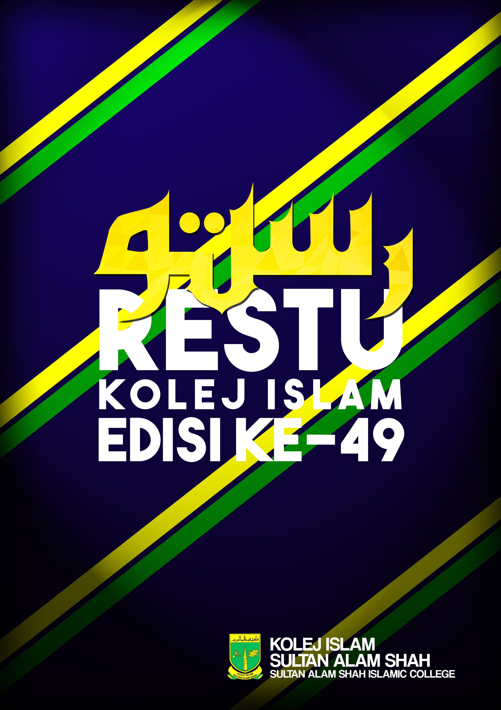

# RESTU Kolej Islam Edisi 49

This repo hosts the source code for the [RESTU 49 web version](https://restu49.netlify.app).



## Thanks

We thank the open source community and all the freemium services that we use to build this site including:
- Docusaurus
- Photopea (for image compression)
- Netlify (for hosting)

We also want to thank all the people that supported and inspired us to revamp this site.

## Contribution

The dev workflow is fairly standard and follows the steps below.

### Installation

```
$ npm i
```

### Local Development

```
$ npm start
```

### Build

```
$ npm run build
$ npm run serve
```

This command generates static content into the `build` directory and can be served using any static contents hosting service.